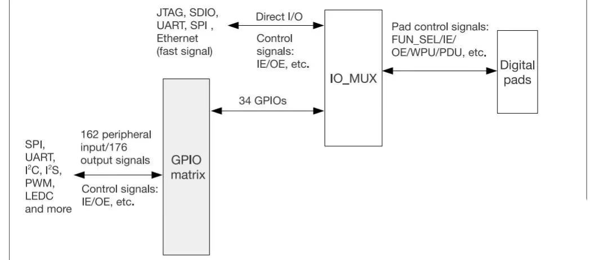
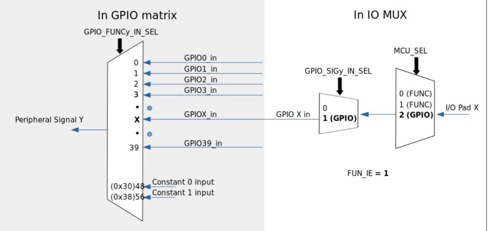
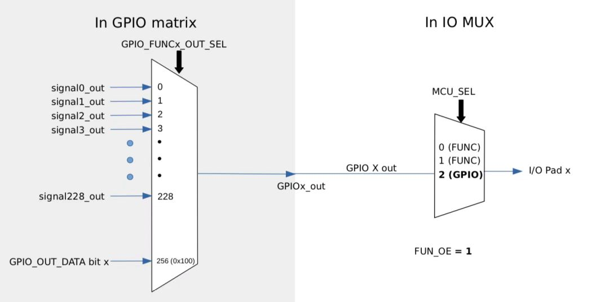
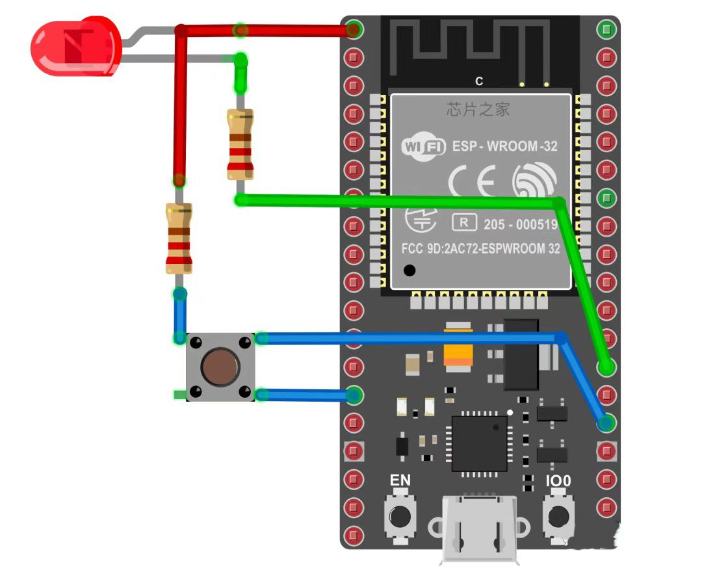
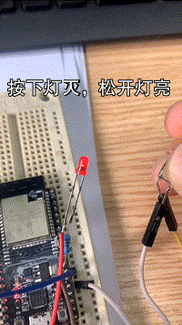

# GPIO数字输入与数字输出  
让我们一起来点灯！  
## 多路复用器与GPIO矩阵
ESP32芯片有34个物理 GPIO Pad，```每个Pad可以当作通用IO，也可以当作外设的引脚```，GPIO 引脚通过非常复杂的 GPIO 矩阵互连，这基本上就是是一个多路复用器，我们可以```非常灵活的选择哪些GPIO引脚在内部路由到哪个外设的信号```，大家可以看下图：  

  

IO_MUX 中每个 GPIO pad 有一组寄存器。每个 pad 可以配置成 GPIO 功能(连接 GPIO 交换矩阵)或者 直连功能。

有一些高速信号如以太网、SDIO、SPI、JTAG、UART 等会旁路 GPIO 交换矩阵以实现更好的高频数字特性。所以高速信号会直接通过 IO_MUX 输入和输出，这样比使用 GPIO 交换矩阵的灵活度要低。

不同于STM32的简单复用，ESP32的多路复用器，使设计人员可以灵活地更改芯片内部的 GPIO 引脚连接并将其路由到任何信号，这样硬件设计上，布线也方便的多。


<center>通过 IO_MUX、GPIO 交换矩阵的外设输入</center> <br>


<center>通过 GPIO 交换矩阵输出信号</center><br>
ESP32还有18个 GPIO 管脚具有低功耗(低功耗 RTC)和模拟功能。  
<br>
<br>  
完整管脚说明需要去参考的乐鑫官方《ESP32 技术规格书》   
 <br> 
 <br>  

**特别提醒**

ESP32的IO12上电时的电平会决定外部flash的工作电压，上电时该脚为高则认为flash工作于1.8V，为低则认为flash工作于3.3V。```常用的模块该脚内部已下拉```，即flash是工作于3.3V的，若外部使用强上拉模块就可能工作异常了。  
 ## 硬件连接   
   
## 数字输出功能 
这里我们就以一个LED灯来演示，首先，我们需要在setup()中初始化对应的IO在输出模式，使用pinMode函数，第一个参数上对应的IO序号，第二个是IO的模式 。 

```pinMode(4, OUTPUT);```

然后可以通过digitalWrite()函数改变数字引脚的电平状态，HIGH输出高平，LOW输出低电平。   
```
digitalWrite(4, HIGH); // 输出高电平  
digitalWrite(4, LOW);  // 输出低电平  
```  
所有 ESP32 GPIO 引脚都可以在输入或输出模式下运行。引脚34-39只能用于输入。还有其他一些引脚也有其它特性，这个我们现在也没必要太纠结，用到的时候再去看就好了。  
## 数字输入功能 
在输入模式下，我们可以通过IO来读取外部数字信号，我们这里用按键来表示。

跟输出模式一样，我们在setup()中初始化对应的IO在输入模式，也使用pinMode函数。  

```pinMode(2, INPUT);```

然后通过digitalRead(GPIO_pin)就可以读取对应IO的电平了。
## 代码示例   
下面的代码我们定义了2个GPIO引脚。GPIO2用于按键输入，GPIO4用于LED输出。  

初始化之后，我们在loop()中不断的读取按键的电平状态，并赋值给LED，实现按键下去灯熄灭，松开灯点亮的效果。  
``` 
#define LED_GPIO 4
#define BTN_GPIO 2
 
int BTN_State = 0; //按键状态
 
void setup()
{
  pinMode(LED_GPIO, OUTPUT);
  pinMode(BTN_GPIO, INPUT);
}
 
void loop()
{
  // 读取按键状态
  BTN_State = digitalRead(BTN_GPIO);
  // 把按键状态做为LED灯的输出
  digitalWrite(LED_GPIO, BTN_State);
}
```
我们按照前面的教程编译程序，刷入开发板，看下效果：  

  


接下来我们用中断的方式实现一下：
attachInterrupt(uint8_t pin, void ()(void), int mode)函数用来配置中断功能：  
* 参数一，GPIO引脚号
* 参数二，中断回调函数
* 参数三，中断触发模式（RISING、FALLING、CHANGE等）  
  
参数三这个可以设置各种模式，例如上升沿触发，下降沿出发，任意沿触发，电平信号等等模式。

我们用上面的例子改一下：  
```
#define LED_GPIO 4
#define BTN_GPIO 2
 
int BTN_State = 0; //按键状态

//中断回调函数
void bt_callBack(void)
{
  BTN_State = digitalRead(BTN_GPIO); // 读取按键状态
  digitalWrite(LED_GPIO, BTN_State); // 把按键状态做为LED灯的输出
}
 
void setup()
{
  pinMode(LED_GPIO, OUTPUT); //LED输出模式
  pinMode(BTN_GPIO, INPUT); //输入上拉模式
  attachInterrupt(BTN_GPIO, bt_callBack, CHANGE); //使能中断
}
 
void loop()
{  
}  
```
主程序中不用做任何事情了，中断检测到有按键按下或松开（任意跳变沿），就会触发执行中断回调函数，然后把结果在LED上输出。

ESP32的GPIO外设相对其它单片机，功能还是略微复杂的，但是不管是SDK的开发还是Arduino方式，```官方都帮我们写好相应的库了，复杂的配置都已经定义好了，我们直接调用即可```，怎么样，是不是非常简单？

感兴趣的同学也可以打开官方的库，看看是怎么配置寄存器的，会有一个更深的理解。  

感谢大家，希望大家**Enjoy!**