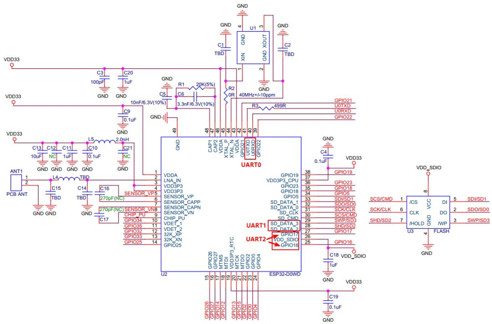
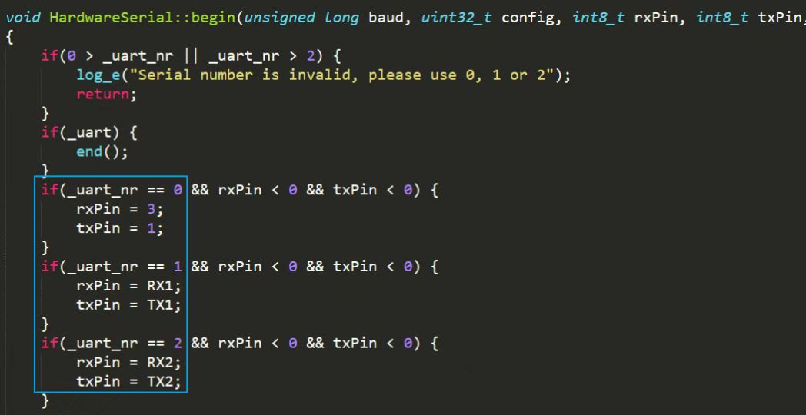
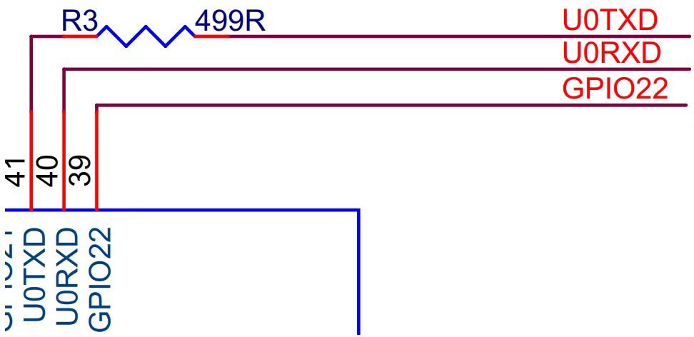
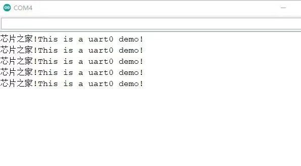
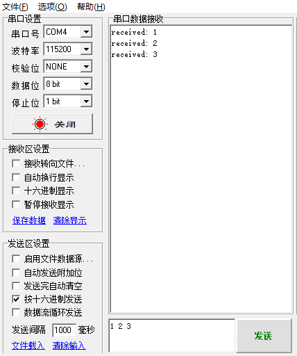

# **串口**  
今天让我们一起来学```串口```！  
## <table><tr><td bgcolor=LightSeaGreen> 概述</td></tr></table>  
ESP32 芯片有```3 个```UART 接口，UART0，UART1，UART2，支持异步通信和 IrDA，通信速度最高可达 5Mbps，3 个接口可以被 DMA 或 CPU 直接访问，3 个串口带发送接收 FIFO，共享 1024*8bit 的 RAM，通过串口，我们可以非常方便的跟其它外设进行通信或者打印数据。  
## <table><tr><td bgcolor=LightSeaGreen> 硬件</td></tr></table>  
  

上图是硬件参考设计，我把默认的串口标注出来了，我们可以在Arduino的库中看到默认的引脚，如下图：

  
```
#include<stdlib.h>
#include<stdio.h>
#include<string.h>
#include<inttypes.h>

#include<pain_arduino.h>
#include<HardwareSerial.h>

#ifndef RX1
#define RX1 9
#endif

#ifndef TX1
#define TX1 10
#endif

#ifndef RX2
#define RX2 16
#endif

#ifndef TX2
#define TX2 17
#endif
```

UART0 引脚直接在函数里面定义了，UART1、UART2使用宏定义，大家还记得我们在GPIO章节中说的吗，```ESP32有GPIO矩阵```，外设都可以随意映射到绝大部分的引脚，比如我们想把UART2的引脚改变到GPIO26 GPIO27这两个上，我们直接调用相关函数就行了，这些都是可以实现的，```硬件上非常灵活```。  

U0TXD 线上需串联 499 Ω 电阻用于抑制 80 MHz 谐波。ESP32 UART 串口电路如下图所示：  

  

这里还需要注意下，UART1的默认引脚为GPIO9,、GPIO10，这两个接口一般用于连接外部Flash，程序中默认使用这两个引脚的，```所以我们在用的时候一定记得改到别的IO口```。  
## <table><tr><td bgcolor=LightSeaGreen> 软件</td></tr></table>  
关于串口的一些概念，包括原理，波特率，停止位，奇偶校验，流控等概念，这些概念非常基础，这里就不展开篇幅说了，需要的小伙伴自行了解，不同芯片，原理都是一样的。

我们讲一下```基础的使用```：

首先我们需要在setup()中对串口进行初始化，非常简单，就一行代码搞定： 
```
Serial.begin(115200);
```  
这里默认是UART0的，将UART0波特率初始化为115200，其它参数都是默认的，```如果我们想将UART0的TX RX改一下呢```，我们看下面：  
```
Serial.begin(115200,SERIAL_8N1,26,27);
```  
通过上面的函数，我们就把RX改到了26，TX改到了27，第一个参数为波特率设置，如果输入0就会自动监测波特率，第二个为串口配置参数，SERIAL_8N1为8位数据位，无校验位，1位停止位的意思，还有其它参数，```大家可以自行到源码中看看```，加深印象。  

看到这里才体会到GPIO矩阵的妙处，硬件设计大大的简化啊！

关于串口的函数，我们这里介绍几个常用的，完整的可以在```HardwareSerial```类中看到。  
```
void begin(unsigned long baud, uint32_t config=SERIAL_8N1, int8_t rxPin=-1, int8_t txPin=-1, bool invert=false, unsigned long timeout_ms = 20000UL); //串口初始化
void end();//失能串口
void updateBaudRate(unsigned long baud);//重新设置波特率
int available(void);//返回串口接收缓冲区中的数据
int read(void);//返回串口接收缓冲区的一个字节的数据，之后将缓冲区中的本字节删除
void flush(void);//等待串口收发数据完毕
size_t write(uint8_t);//写数据到TX缓冲区
size_t setRxBufferSize(size_t);//设置接收缓冲区的大小  
```  
这里只是简单展示几个函数，具体的用法有不懂的，或者想了解全部函数的，可以在arduino-esp32中打开具体的库看用法，只有这样，大家才能深刻了解，这里只是带大家进门。

库函数中有标准输入输出函数，所以打印函数必不可少的了，我们常用的打印函数如下：  
```
Serial.print("芯片之家!"); //打印数据
Serial.println("This is a uart0 demo!"); //打印并换行
```  
当然，也可以各种格式化打印，大家可以自行尝试！  
```
Serial.println(data) //从串行端口输出数据，跟随一个回车（ASCII 13, 或 'r'）和一个换行符（ASCII 10, 或 'n'）。这个函数所取得的值与 Serial.print()一样。
Serial.println(b) //以十进制形式输出b的ASCII编码值，并同时跟随一个回车和换行符。
Serial.println(b, DEC)// 以十进制形式输出b的ASCII编码值，并同时跟随一个回车和换行符。
Serial.println(b, HEX) //以十六进数据形式输出b的ASCII编码值，并同时跟随一个回车和换行符。
Serial.println(b, OCT)//以八进数据形式输出b的ASCII编码值，并同时跟随一个回车和换行符。
Serial.println(b, BIN)//以二进数据形式输出b的ASCII编码值，并同时跟随一个回车和换行符。
Serial.print(b, BYTE)//以单个字节输出b，并同时跟随一个回车和换行符。
Serial.println(str)//如果 str是一个字符串或数组，输出整个 str的 ASCII编码字符串。
Serial.println()//仅输出一个回车和换行符。  
```  
完整程序1：  
```
void setup()
{
  Serial.begin(115200);
}
 
void loop()
{
  Serial.print("芯片之家!"); 
  Serial.println("This is a uart0 demo!"); 
  delay(1000);
}
```  

  


完整程序2：
```
int recData; //接收的数据
 
void setup() {
  Serial.begin(115200); 
}
 
void loop() {
  // 收到什么发什么数据
  if (Serial.available() > 0) {
    // 读取一个字节
    recData = Serial.read();
    Serial.print("received: ");
    Serial.println(recData,HEX);
  }
}
```
  


感谢大家！