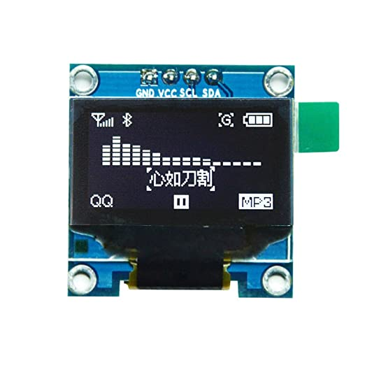

.. _oled-esp32-ssd1306:

使用ESP32控制SSD1306 OLED显示屏
======================================

本文介绍了如何使用ESP32控制SSD1306 OLED显示屏。SSD1306是一种OLED显示屏控制器，支持多种分辨率的OLED显示屏，包括128x64、128x32和96x16等。ESP32是一种低功耗、高性能的微控制器，可用于控制SSD1306芯片并显示文本、图像和动画等内容。

介绍
-----

OLED（Organic Light Emitting Diode）是一种有机发光二极管技术。OLED显示屏由一层有机薄膜、电极和基底组成。在通电时，有机薄膜中的有机化合物会发生电子注入，产生激子（电子与空穴的复合体），然后激子发生退激发光的过程，从而发出光。OLED显示屏的亮度和颜色取决于有机化合物的种类和结构。有机化合物可以是单色的，也可以是多色的，可以通过不同的材料组合来实现多种颜色。

SSD1306是一种控制OLED显示屏的芯片，它可以通过SPI或I2C(IIC)接口与ESP32等外部设备通信。控制SSD1306芯片可以控制OLED显示屏的亮度、颜色、位置、字体和图像等参数，实现文本、图像和动画的显示。

在这里我们使用I2C(IIC)接口，因此代码也是基于IIC通信。

在使用SSD1306控制OLED显示屏时，需要注意以下几点：

- 电源：SSD1306需要3.3V的电源供应。通常情况下，OLED显示屏上也需要接受3.3V电源。如果使用5V电源，则需要使用电压转换器将电压降低到3.3V。

- 引脚：SSD1306如果使用I2C接口，则需要连接SDA和SCL引脚。连接引脚时，需要注意正确的引脚对应关系。

- 库文件：如果您使用Arduino或其他开发平台来控制SSD1306，则需要使用相应的库文件。库文件可以使控制OLED显示屏更加方便。常见的库文件包括Adafruit SSD1306、U8g2和OLED_I2C等。

- 显示图像：使用SSD1306控制OLED显示屏可以显示文本、图像和动画等内容。在显示图像之前，需要设置图像的位置、大小、颜色和格式等参数，然后将数据传输给SSD1306芯片，最后刷新OLED显示屏以显示图像。

步骤
----

下面是基于 `MP-0` 使用ESP32控制OLED显示屏的步骤：

1. 准备硬件：在MP-0中，使用IIC通信，已经有如下引脚连接关系:SCL(OLED)--IO22(ESP32),SDA(OLED)--IO21(ESP32)。

2. 安装库文件：在控制SSD1306之前，需要安装相应的库文件。需要的库文件包括Adafruit SSD1306和Adafruit_GFX。打开Arduino IDE，并单击“工具”菜单。将鼠标悬停在“库管理器”菜单项上，然后选择“库管理器”。在“库管理器”窗口中，搜索需要安装的库文件。例如，搜索“Adafruit SSD1306”库。找到需要安装的库文件后，单击其名称。单击“安装”按钮。等待库文件安装完成后，关闭“库管理器”窗口。 `图文教程 <http://wiki.ywrobot.net/index.php?title=Arduino_IDE%E5%BA%93%E7%9A%84%E6%A6%82%E5%BF%B5%E4%BB%A5%E5%8F%8A%E5%BA%93%E6%96%87%E4%BB%B6%E5%AE%89%E8%A3%85%E4%BD%BF%E7%94%A8>`_

3. 初始化SSD1306：在控制OLED显示屏之前，需要向SSD1306芯片发送一些初始化命令，例如设置显示分辨率、选择字体、设置亮度和颜色等。初始化命令可以在库文件中找到，然后通过I2C接口发送给SSD1306。

4. 写入数据：一旦SSD1306被初始化，就可以向其写入数据，例如文本、图像或动画等。在写入数据之前，需要设置数据的位置和格式，例如设置光标位置、选择字体和颜色等。数据可以通过SPI或I2C接口传输给SSD1306。

5. 刷新屏幕：一旦数据被写入SSD1306芯片，就可以刷新OLED显示屏以显示数据。

6. 更新数据：一旦数据被写入OLED显示屏，就可以根据需要更新数据。更新数据可以使用相同的步骤，包括设置数据的位置和格式、写入数据和刷新屏幕。

代码
----

下面是使用Adafruit SSD1306库文件和SPI接口控制SSD1306 OLED显示屏的代码：

.. code-block:: c++

    #include <Wire.h>
    #include <Adafruit_GFX.h> // 添加Adafruit_GFX.h库
    #include <Adafruit_SSD1306.h>

    #define SCREEN_WIDTH 128
    #define SCREEN_HEIGHT 64

    Adafruit_SSD1306 display(SCREEN_WIDTH, SCREEN_HEIGHT, &Wire, -1);

    void setup() {
      Wire.begin();
      display.begin();
      display.clearDisplay();
      display.setTextSize(1);
      display.setTextColor(WHITE);
      display.setCursor(0, 0);
      display.println("Hello, world!");
      display.display();
    }

    void loop() {
      // do nothing
    }

更多用法详见 `深入学习OLED <https://blog.51cto.com/dpjcn1990/2978392>`_

