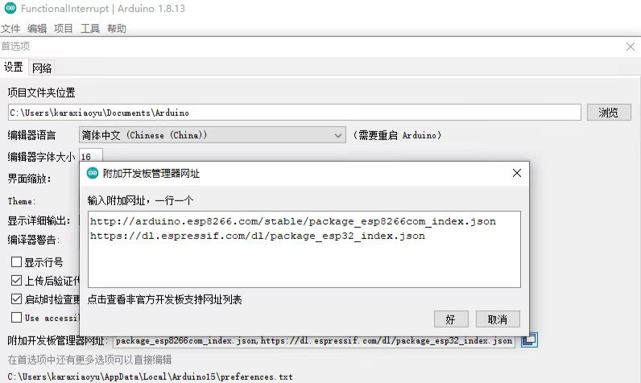
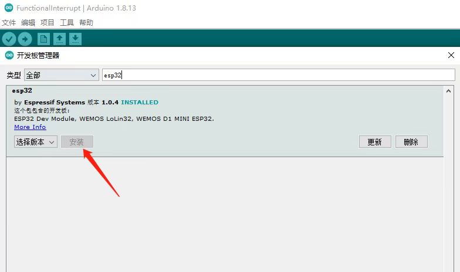
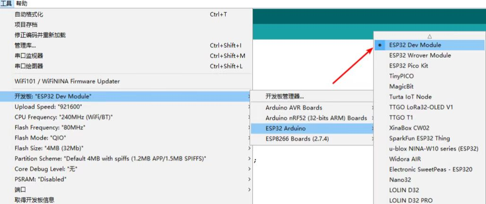
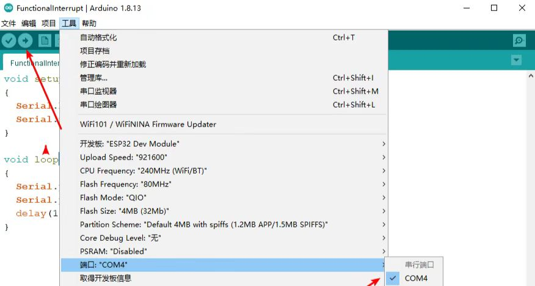
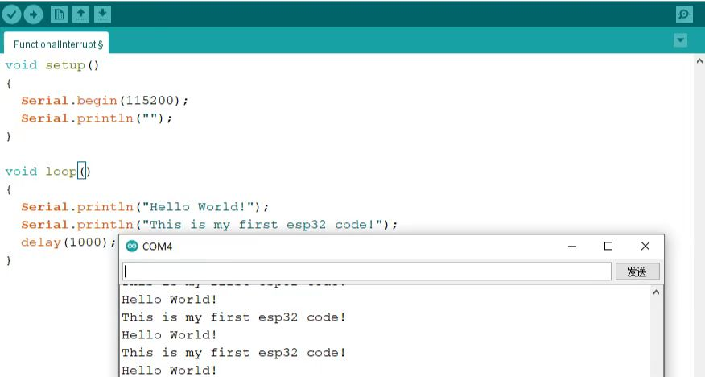

# 开发环境搭建
 * Arduino软件安装,下载Arduino IDE并安装，当然也可以用其它编辑器，VSCode + PlatformIO IDE插件等方式，这个后续介绍。<https://www.arduino.cc/en/software>  
 * Arduino IDE中添加对应开发板，在文件->首选项->附加开发板管理网址中，添加ESP32的管理网址：<https://dl.espressif.com/dl/package_esp32_index.json>  
      
* 添加开发板，在工具->开发板->开发板管理中，搜索esp32，如下图所示，安装Arduino core for esp32，过程可能比较慢，也可能需要科学上网才能安装好。  
  
* 然后选择中对应的开发板，我们可以看到这里有很多不同的ESP32开发板，这里选择ESP32 Dev Module就可以了。  
 
## 程序测试
``` 
void setup()
{
  Serial.begin(115200);
  Serial.println("");
}
void loop()
{
  Serial.println("Hello World!");
  Serial.println("This is my first esp32 code!");
  delay(1000);
} 
```
 默认已经引用了ESP32的头文件，通过```Serial.begin(115200);```初始化串口波特率之后，就可以通过```Serial.println();```打印输出了。  
 选中对应串口并点击```编译下载```  
  
通过串口观察实际效果  
   

今天我们先介绍到这里,后面我们会一一介绍ESP32的外设,敬请期待!