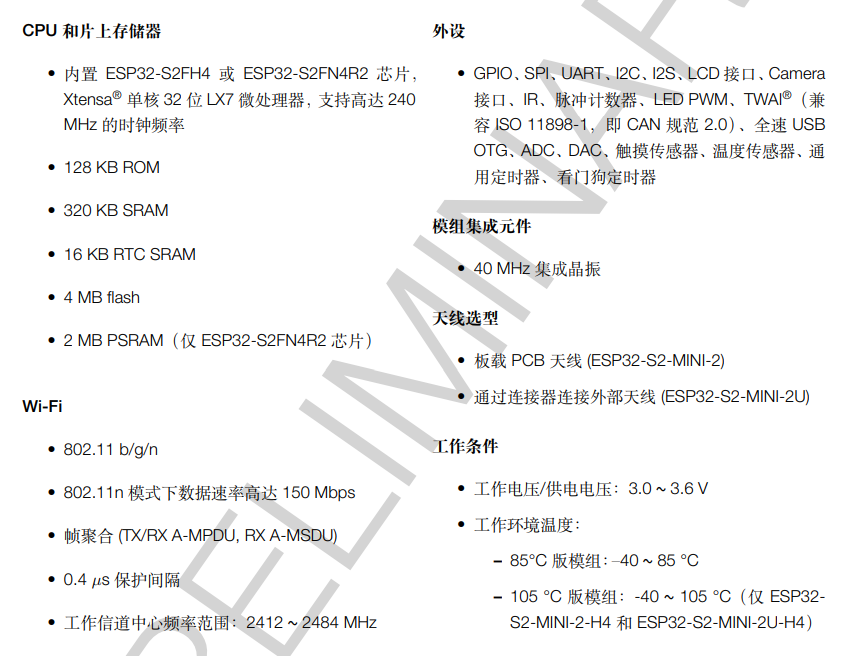
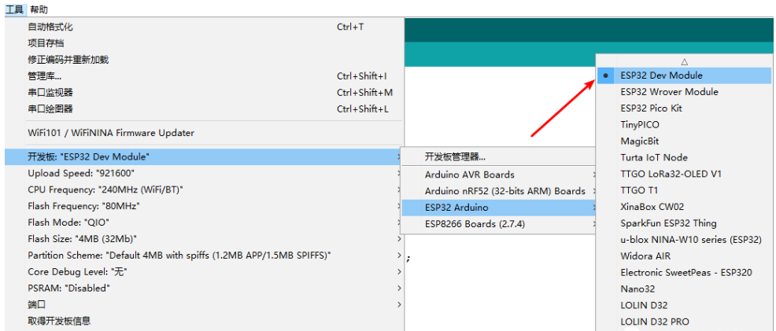
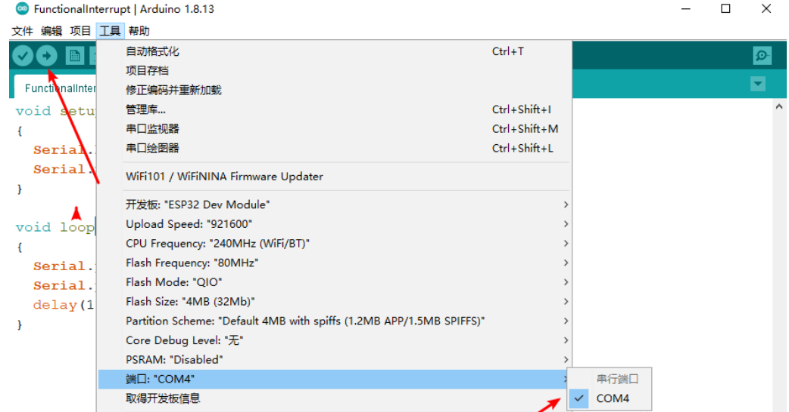

ESP32环境搭建
~~~~~~~~~~~~~~~~~~~~~~~~~~~~~~~~~~~~~~~~~~~~~~~~

1. ESP32介绍

   ESP32芯片是由乐鑫公司继 ESP8266 芯片后推出的又一款集成 WiFi/BLE 功能的微控制器。性能比 ESP8266 更加强大，ESP32 芯片或模组具有下列特点：

2. 开发环境搭建

   - Arduino软件安装:访问 `<https://www.arduino.cc/en/software>`_,下载ArduinoIDE并安装,后续可以联合vscode进行编程。
   
   - Arduino IDE中添加对应开发板，在文件->首选项->附加开发板管理网址中，添加ESP32的管理网址： `https://raw.githubusercontent.com/espressif/arduino-esp32/gh-pages/package_esp32_index.json`

   - 添加开发板：在工具->开发板->开发板管理中，搜索esp32，点击安装。

   - 然后选择对应的开发板，这里选择ESP32 Dev Module

3. 程序测试   

.. code-block:: c++
   :linenos:

   void setup()
   {
     Serial.begin(115200);
     Serial.println("");
   }
   void loop()
   {
     Serial.println("Hello World!");
     delay(1000);
   }

用usb线连接单片机后，选中对应串口并点击编译下载

打开工具->串口监视器，选择对应的波特率（115200），观察数据。