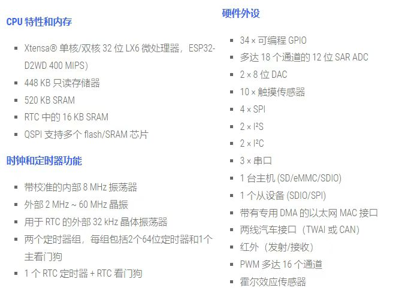
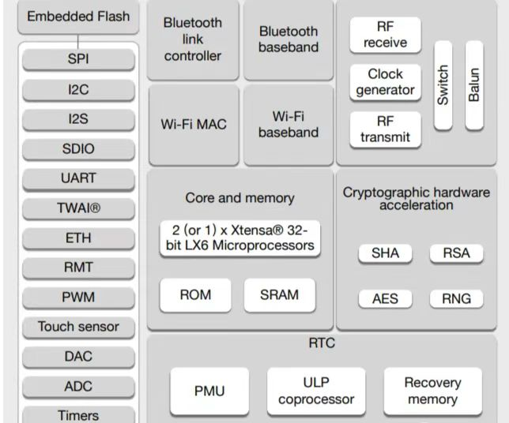
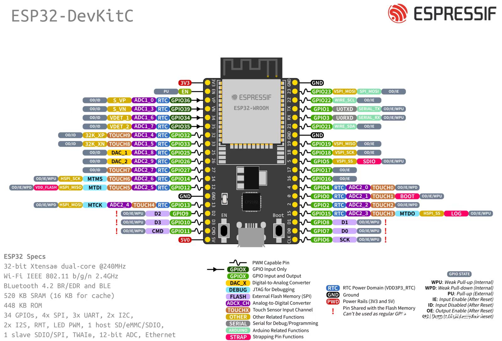

ESP32入门教程
===============

ESP32 芯片是由乐鑫公司继 ESP8266 芯片后推出的又一款集成 WiFi/BLE 功能的微控制器。性能比 ESP8266 更加强大，ESP32 芯片或模组具有下列特点: 

功能框图：

引脚图:  

本教程是为了帮助大家快速入门ESP32，本教程的内容包括：

.. toctree::
   :maxdepth: 1
   
   ESP32环境搭建.md
   ESP32GPIO.md
   ESP32串口.md
   ESP32控制OLED.rst
   电机控制.rst

想要了解更多关于ESP32的内容，请移步官网查询：

https://www.espressif.com.cn/zh-hans/products/socs/esp32
