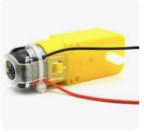
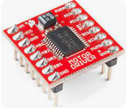
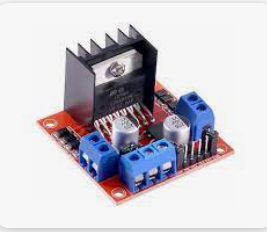

电机控制
~~~~~~~~~~~~~~~~~~~~~~~~~~~~~~~~~~~~~~~~~~~~~~~~

1. 直流减速电机

直流减速电机控制原理非常简单，当给电机两根线一个压差时，电机就会获得一个速度，压差越大，电机速度越大。最简单的方法是直接用电池正负极接电机两端，可以用于测试电机好坏。

2. 电机驱动器

单片机能够输出5V的电压，但无法驱动电机，因为单片机输出电流的能力很小，即带负载能力小，带不动电机，因此需要一个驱动器，通过单片机控制驱动器，驱动器来输出电流驱动电机。常见直流减速电机驱动器如下：

`TB6612 <https://blog.csdn.net/qq_34071268/article/details/75174889>`_

`L298N <https://zhuanlan.zhihu.com/p/346930154>`_

3. TB6612具体控制方法

一个TB6612模块能够独立控制两个电机，控制一个电机需要3个单片机引脚，分别为起名为IN1,IN2,PWM。其中IN1和IN2用于控制电机旋转的方向，PWM用于控制电机旋转的速度。参见 `<https://zhuanlan.zhihu.com/p/83373994>`_

4. 给出一个控制四个电机的例程如下

.. code-block:: c++
   :linenos:

    void SetDirectionAndSpeed(int speed1, int speed2, int speed3, int speed4)
    {
        /*不同电机接线方向可能不同，改IN1 和 IN2的逻辑*/
        if (speed1 < 0)
        {
            speed1 *= -1;
            digitalWrite(IO_M1IN1, HIGH);
            digitalWrite(IO_M1IN2, LOW);
            analogWrite(IO_M1PWM, speed1);
        }
        else
        {
            digitalWrite(IO_M1IN1, LOW);
            digitalWrite(IO_M1IN2, HIGH);
            analogWrite(IO_M1PWM, speed1);
        }
        if (speed2 < 0)
        {
            speed2 *= -1;
            digitalWrite(IO_M2IN1, HIGH);
            digitalWrite(IO_M2IN2, LOW);
            analogWrite(IO_M2PWM, speed2);
        }
        else
        {
            digitalWrite(IO_M2IN1, LOW);
            digitalWrite(IO_M2IN2, HIGH);
            analogWrite(IO_M2PWM, speed2);
        }
        if (speed3 < 0)
        {
            speed3 *= -1;
            digitalWrite(IO_M3IN1, HIGH);
            digitalWrite(IO_M3IN2, LOW);
            analogWrite(IO_M3PWM, speed3);
        }
        else
        {
            digitalWrite(IO_M3IN1, LOW);
            digitalWrite(IO_M3IN2, HIGH);
            analogWrite(IO_M3PWM, speed3);
        }
        if (speed4 < 0)
        {
            speed4 *= -1;
            digitalWrite(IO_M4IN2, HIGH);
            digitalWrite(IO_M4IN1, LOW);
            analogWrite(IO_M4PWM, speed4);
        }
        else
        {
            digitalWrite(IO_M4IN2, LOW);
            digitalWrite(IO_M4IN1, HIGH);
            analogWrite(IO_M4PWM, speed4);
        }
    }

.. attention:: 对于不同的电机接线方向可能不同，因此需要调试IN1和IN2的高低电平逻辑来使得速度为正时，电机确实向前转。