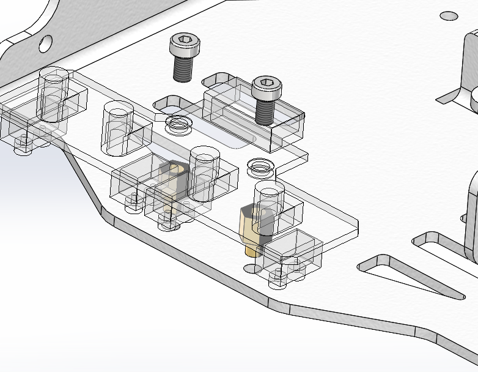

Mashed Potato Zero(MP-0)
================================

Mashed Potato Zero(MP-0)是北京智慧土豆科技有限公司研发的首款竞赛智能车，基于ESP-32控制核心设计，采用了麦克纳姆轮作为底盘，搭载了超声波、多路循线、IMU等模块，具有高性能、高可靠性、高可扩展性等特点。   

   
.. toctree::
   :hidden:
   :maxdepth: 5

   安装说明
