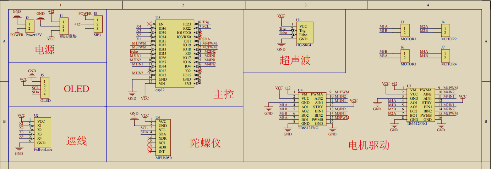

嵌入式开发
====================

介绍
-----

本教程是基于MP-0一个参考学习计划，重点在于各个阶段应该掌握的知识和能够完成的任务，该教程旨在提供学习方向和掌握知识所需参考资料。

PCB原理图
----------

在进行嵌入式开发之前，首先应该知道单片机和各个模块是如何连接的。以控制电机为例，控制电机需要使用电机驱动模块，而电机驱动模块的控制引脚是和单片机的一些引脚连接起来的，那么就需要知道单片机的哪些引脚连接到了驱动模块上，这就需要能看懂 ``原理图``。

在电子设计领域，原理图是一种用于表示电路连接方式的图形语言。它通常由电子符号、连线、电源、接地等元素组成，用于描述电路中器件之间的连接方式和信号传输路径。

在原理图中，电子元件用标准的电子符号来表示，例如二极管、电阻、电容、晶体管等。连线用于连接不同的器件，表示电子元件之间的电路路径。电源用于表示电路的电源，接地用于表示电路中的参考电位。

黄色方块代表一个元器件，方块引出引脚，引脚具有自己的名称。如图即为一个叫做VCC的引脚。

|

网络标号：网络标号代表一种电气连接，即所有相同网络标号的点在物理上都是连接起来的。例如下面MP-0原理图中的深红色X1就是一个网络标号，同时连接到了巡线模块的X1（黑色）引脚上和ESP32主控的IO35上。因此在PCB板上这两个引脚之间具有电气连接。

参考资料：

`什么是电路原理图？如何设计电路原理图？ <https://zhuanlan.zhihu.com/p/34131806>`_

MP-0原理图
-------------

|

学习计划
-------------

1. 了解 ``单片机`` 的概念，了解 ``ESP32`` 相关的知识，掌握单片机的运行原理。使用ArduinoIDE搭建编程环境，掌握Arduino的使用方法，掌握如何 ``管理库`` 。

   参考资料:

   本网站的 ``ESP32入门教程``。

   `单片机的构成原理 <https://www.renesas.cn/cn/zh/support/engineer-school/mcu-01-basic-structure-operation>`_

   `ESP32快速入门指南 <https://zhuanlan.zhihu.com/p/105178847>`_

2. 了解 ``GPIO`` 的概念，了解通过GPIO控制LED灯亮灭的原理。学会如何配置ESP32IO口的模式，如输出模式和输入模式，即可以输出高低电平或读取高低电平。掌握 ``setup`` 函数和 ``loop`` 函数的作用。了解 ``delay()`` 延时函数，能够控制板载LED以一定规律闪烁。

   参考资料:

   `Arduino ESP32学习笔记2-点灯 <https://blog.csdn.net/weixin_44098974/article/details/127224800>`_

3. 掌握了GPIO的使用之后，了解巡线模块的概念，即检测黑线或白线返回高电平或低电平，在不同的光照条件下可能需要调节电位器，见下面的参考资料。巡线模块返回高低电平，通过原理图来看巡线模块四路连接到了单片机的哪些引脚(35 34 36 39),将这些引脚配置成输入模式，读取高低电平即可知道灰度传感器的状态。

   参考资料：

   `四路巡线模块 <https://detail.tmall.com/item.htm?abbucket=18&id=608662293743&ns=1&spm=a230r.1.14.6.287a683dv971Fu>`_

4. 了解OLED的使用方法，参见本网站教程 ``ESP32控制OLED`` 。

5. 了解使用ESP32控制电机的方法，参见本网站教程 ``电机控制`` 。

6. 了解如何使用ESP32读取超声波模块的数据。

   参考资料：

   `esp32读取超声波模块 <https://blog.csdn.net/qq_49516462/article/details/129385142>`_

   

7.  了解陀螺仪的概念，MPU6050是一款集成了三轴陀螺仪和三轴加速度计的MEMS传感器，是一款非常流行的惯性测量单元（IMU），被广泛应用于飞行控制、姿态稳定、智能手环、智能手表、智能手机等各种应用中。可以测量机器人的姿态，即欧拉角。掌握如何使用ESP32读取陀螺仪的数据。

   参考资料：

   `pitch yaw roll是什么 <https://blog.csdn.net/yuzhongchun/article/details/22749521>`_

   `ESP32使用Arduino环境读取MPU6050 <https://blog.csdn.net/weixin_42854045/article/details/127310247>`_

