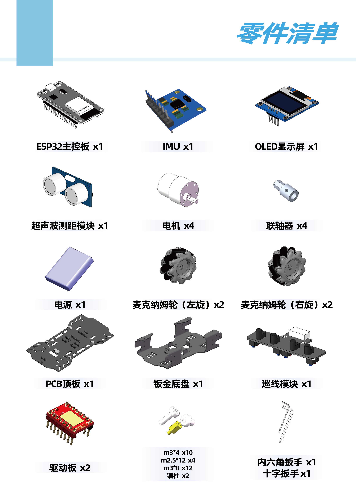
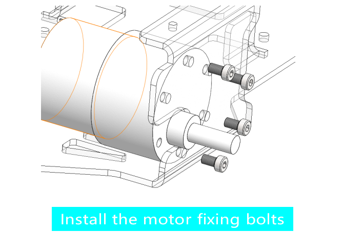
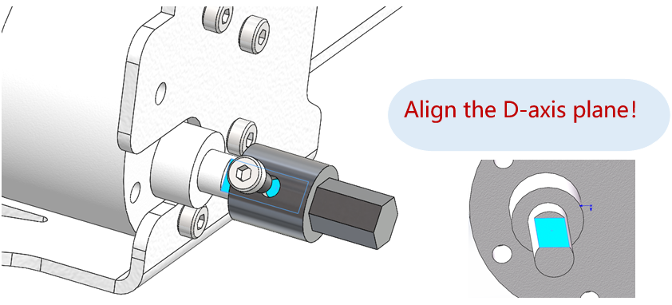
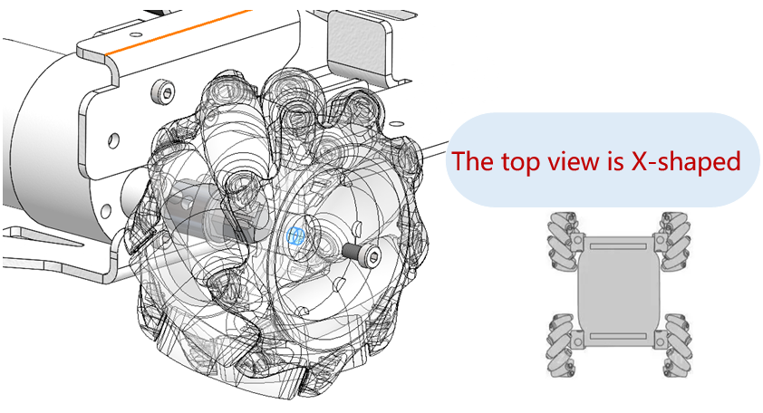
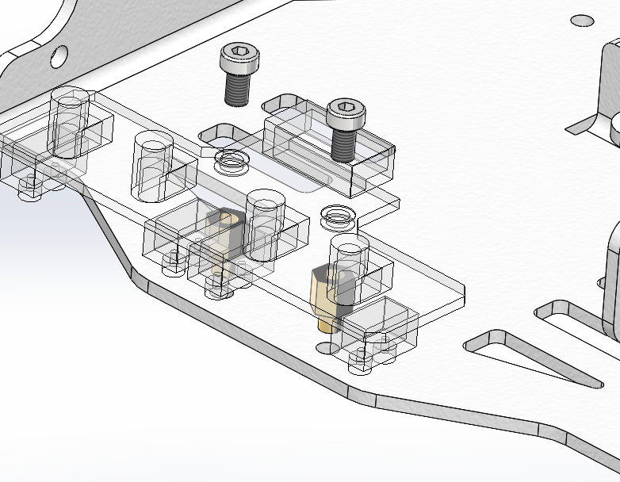
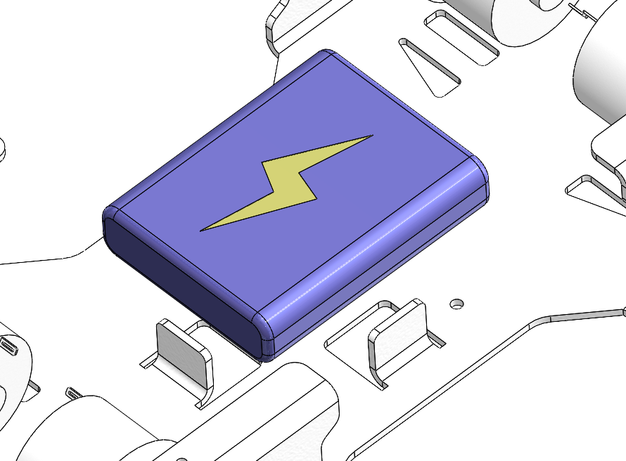
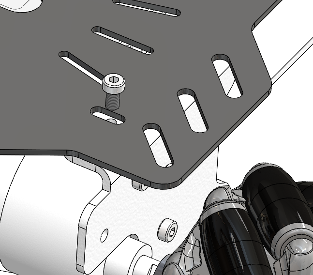

机械安装说明
================================================

本说明书介绍如何构建大学生第一台MP-0。本产品使用的麦克纳姆轮是一种特殊的全向轮，能够实现小车在任何方向上的平稳移动。选用的JGB37-520减速电机则是一款高性能、低噪音的直流减速电机，适用于各种轻型移动平台。

材料清单
~~~~~~~~~~~~~

1. JGB37-520减速电机 × 4（已安装xh2.54端子）
2. 麦克纳姆轮 × 4
3. 钣金底盘 × 1
4. 上层PCB板 × 1
5. 电池盒 × 1
6. M3*4圆头螺栓 × 10
7. M3*8圆头螺栓 × 12
8. 超声波测距模块 × 1
9. 陀螺仪模块 × 1
10. 电机驱动模块 × 1
11. ESP32主控板 × 1
12. OLED显示屏 × 1
13. 巡线模块 × 1
14. 螺丝刀、扳手等基本工具

组装步骤
~~~~~~~~~~~~~

1. 准备工具和材料
^^^^^^^^^^^^^^^^^^^^
确保所有必要的工具和材料已备齐。

.. attention:: 螺栓选择正确型号，组装过程严格按照说明书的顺序。

2. 底盘安装
^^^^^^^^^^^^^^^^
采用钣金底盘作为麦克纳姆轮四驱小车的底盘，确保底盘有足够的空间容纳电池、电子元件和电机。

.. attention:: 钣金底盘的攻丝孔因为工艺特点，可能出现难以旋进的问题，用户可反复松拧，直至顺畅，但是禁止暴力安装。

3. 安装电机
^^^^^^^^^^^^^
将JGB37-520减速电机分别安装在底盘的四个角上，使用M3*8圆头螺栓将电机固定在底盘上(M3*8圆头螺栓代表螺纹外径为3mm，螺纹长度8mm的内六角螺栓，使用产品提供的六角扳手安装)。确保电机轴向外延伸，方便安装联轴器。

4. 安装联轴器
^^^^^^^^^^^^^^
将联轴器与电机轴连接，使用M3*4(外径为3mm，螺纹长度4mm)圆头螺栓固定，确保螺栓顶在电机轴的D形平面上。

5. 安装麦克纳姆轮
^^^^^^^^^^^^^^^^^^^
将麦克纳姆轮与联轴器连接，使用M2.5*12杯头螺栓(外径为2.5mm，螺纹长度12mm)固定。注意确保轮子间的角度关系正确，轮胎的滚子应呈45°角排列，机器人上视图视角中，麦克纳姆轮辊子应呈X形。安装完毕后检查麦克纳姆轮是否能顺畅旋转。

4. 安装巡线模块
^^^^^^^^^^^^^^^^^
先将铜柱安装在底盘上，再使用M3*4螺栓将巡线模块固定在铜柱上。

7. 安装电池
^^^^^^^^^^^^^
选择底盘中间的位置将电池安装在底盘上，使用扎带固定电源主体和充电接口。

8. 安装PCB板
^^^^^^^^^^^^^
将PCB板用4个M3*4圆头螺栓固定在底盘上，确保电子元件与电机的连接顺畅。安装时优先选择对角连接，采取先预固定，后拧紧的方式。

.. attention:: PCB板安装到底盘上时，先安装对角孔位，预固定后将所有螺栓全部安装后再统一拧紧。

9. 安装PCB板上的模块
^^^^^^^^^^^^^^^^^^^^^^^
参照顶板图案提示和模块各引脚的对应关系，将超声波测距模块、陀螺仪模块、电机驱动模块、ESP32主控板和OLED显示屏按照预留位置安装在PCB板上。

.. attention:: 务必注意模块安装方向，若反接可能会导致模块损坏。

.. image:: ./media/宣传册3.png
   :align: center

10. 连接线缆
^^^^^^^^^^^^^^^
将电机的xh2.54端子引出，穿过PCB板的孔位中并连接在PCB板的上层接口上，接口与电机的连接遵循就近原则，注意不要接错。同理将巡线模块和电源的线缆引出到顶板并安装在对应接口上。

注意事项
~~~~~~~~~~~~~
.. attention:: 在使用过程中，请定期检查螺丝紧固情况以及电机、轮子等部件的磨损情况，以确保小车正常运行。
